# 基于彩色标记点的高速视觉测量：成像光学、颜色测量与轨迹重建

---

- 题目：基于彩色标记点的高速视觉测量：成像光学、颜色测量与轨迹重建
- 专业：应用物理学(强基)
- 姓名：施建辉
- 学号：2450131
- 日期：2025年12月

---

## 摘要

本文面向刚体高速旋转实验（如贾尼别科夫效应观测）的视觉测量需求，设计并实现了一套基于彩色圆点标记的目标检测与轨迹重建系统。系统在成像端通过分析针孔模型、曝光控制与光照光谱等光学因素，建立了颜色测量的理论框架；在算法端采用 HSV 颜色分割与形态学去噪，结合椭圆拟合实现亚像素级中心定位，并通过时空连续性与运动幅度阈值抑制背景误检。

针对实验中常见的过曝、运动模糊及背景干扰问题，本文提出了**多段 HSV 阈值并集策略**以适应非均匀光照，并引入**圆度与面积匹配度双重约束**提升椭圆拟合的可靠性。以三机位同步拍摄的 12.16 实验数据为例（485 帧，约 0.87 s），本文在完成 2D 检测后进一步结合多视图三角测量与刚体配准/优化，重建姿态序列（旋转矩阵/四元数）与 Body 系角速度，并给出相空间轨迹、能量/角动量一致性与理论对比等结果；在拟合阻尼模型参数后，理论与实验的角速度平均绝对误差（MAE）约为 2.28 rad/s，能量耗散趋势与预期一致。

**关键词**：彩色标记；HSV 颜色空间；成像光学；曝光与运动模糊；椭圆拟合；视觉测量

---

## 目录

1. 引言
2. 光学基础与成像误差分析
3. 系统方案与算法流程
4. 实验设计与结果
5. 讨论：光学因素与改进建议
6. 结论与展望
   参考文献
   附录

---

## 1 引言

### 1.1 研究背景与项目起源

本项目的核心目标是**测量三维空间中刚体的姿态角**（即旋转矩阵 $\mathcal{R}(t)$ 或等价的欧拉角/四元数表示），进而提取角速度 $\vec\omega(t)$ 用于动力学分析。在经典力学实验中，对刚体三维姿态与运动轨迹的精确测量是验证物理定律（如角动量守恒、中间轴不稳定定理——即"贾尼别科夫效应"）的关键。

传统测量方法存在诸多局限：

- **惯性测量单元（IMU）**：需要固定在刚体上，改变刚体质量分布，影响实验的纯粹性；
- **商业动作捕捉系统**：设备昂贵（数十万元），且多为红外主动标记，不适合教学与普及型实验；
- **机械传感器**：接触式测量，难以用于高速旋转场景。

基于计算机视觉的非接触式测量具有**低成本、高灵活性**的优势。通过在刚体表面粘贴彩色标记点，利用相机采集视频并进行图像处理，可以实现对标记点位置的精确跟踪，进而重建刚体的运动轨迹与姿态。

### 1.2 圆点标记的几何与光学优势

本系统选择**彩色圆点**作为标记，兼具几何与光学双重优势：

#### 1.2.1 几何优势：圆→椭圆的透视特性

圆形标记在透视投影下呈现为**椭圆**，这一几何特性带来以下检测便利：

1. **形状可预测**：无论刚体姿态如何变化，圆形标记的投影始终为椭圆（包括特殊情况下的圆），其数学模型简洁、拟合算法成熟（如 `cv2.fitEllipse`）；
2. **中心定位稳定**：椭圆中心在透视变换下近似对应圆心的投影位置，便于实现亚像素级定位；
3. **运动模糊兼容**：高速旋转引起的运动模糊会使圆点在图像中拉伸为椭圆形拖影，而椭圆拟合仍可提取其几何中心，无需额外的去模糊处理；
4. **长宽比编码姿态**：椭圆的长短轴比例隐含了标记平面相对于成像平面的倾斜角度信息，可辅助姿态估计。

#### 1.2.2 光学优势：颜色区分与鲁棒性

选择彩色（而非灰度）标记，有如下光学考量：

1. **颜色对比度**：不同颜色在 HSV 空间中占据不同的色调（Hue）区域，即使在光照变化下，色调信息相对稳定，便于区分多个标记点；
2. **降低匹配歧义**：多点跟踪时，颜色可作为额外的身份标识，减少帧间匹配的复杂度；
3. **反射特性可控**：通过选择哑光材质，可减少镜面反射高光对颜色测量的干扰。

### 1.3 工程约束与困难

本项目的实际工程场景面临以下挑战：

- **高速运动**：刚体旋转角速度可达数 rad/s，导致显著的运动模糊；
- **光照不均匀**：标记点在旋转过程中迎光面/背光面交替，亮度变化剧烈；
- **透视畸变**：圆形标记在成像平面上投影为椭圆，且长宽比随姿态变化；
- **遮挡**：部分标记点可能被刚体自身遮挡，需要算法具备容错能力。

### 1.4 本文贡献

本文针对上述挑战，做出以下主要贡献：

1. **光学-算法链路分析**：将颜色检测问题分解为光学成像链路（光源→反射→成像→采样）与算法处理链路（颜色空间→阈值→形态学→拟合），建立清晰的误差传递模型；
2. **多段 HSV 阈值机制**：设计支持"追加模式"的 HSV 标定工具，允许同一颜色 ID 对应多个 HSV 范围的并集，有效应对光照变化；
3. **增强型椭圆拟合**：引入圆度（Circularity）与面积匹配度（Area Ratio）双重约束，过滤噪声产生的伪椭圆；
4. **排除区域机制**：设计"排除模式"，允许用户标记背景干扰区域的 HSV 范围，在检测掩码中予以剔除；
5. **ROI 选择功能**：支持交互式框选感兴趣区域，减少背景干扰并提升处理效率。

---


## 2 光学基础与成像误差分析

> 本章目标：把系统性能"往回追"到光学与成像链路，解释**为什么同一套算法在不同光照/曝光/镜头条件下表现差异巨大**。

### 2.1 成像几何：针孔模型、像素坐标与尺度

#### 2.1.1 针孔相机模型

相机的成像过程可由**针孔相机模型（Pinhole Camera Model）**近似描述。设空间中一点 $P$ 的三维坐标为 $(X, Y, Z)$（相机坐标系），其在图像平面上的投影点 $(u, v)$ 满足透视投影关系：

$$
u = f_x \frac{X}{Z} + c_x, \quad v = f_y \frac{Y}{Z} + c_y
$$

其中：

- $f_x, f_y$ 为以像素为单位的焦距；
- $(c_x, c_y)$ 为图像主点坐标（通常接近图像中心）。

用齐次坐标表示为：

$$
s \begin{pmatrix} u \\ v \\ 1 \end{pmatrix} = \mathbf{K} \begin{pmatrix} X \\ Y \\ Z \end{pmatrix}, \quad \mathbf{K} = \begin{pmatrix} f_x & 0 & c_x \\ 0 & f_y & c_y \\ 0 & 0 & 1 \end{pmatrix}
$$

矩阵 $\mathbf{K}$ 称为**相机内参矩阵**。

#### 2.1.2 透视投影的几何效应

由透视投影的非线性特性，空间中的**圆形标记**在图像平面上通常呈现为**椭圆**。只有当标记平面与成像平面完全平行时，投影才保持为圆。这一几何事实决定了本系统必须采用椭圆拟合而非圆检测。

设标记点直径为 $D$，距相机距离为 $Z$，则其在图像上的直径约为：

$$
d_{\text{px}} \approx \frac{f \cdot D}{Z}
$$

对于本实验典型参数（$f \approx 800$ 像素，$D = 2$ cm，$Z = 50$ cm），标记点在图像上的直径约为 $32$ 像素，满足后续轮廓分析与椭圆拟合的精度要求。

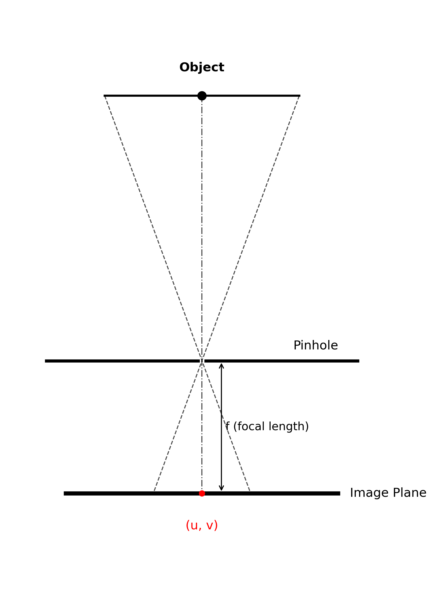

*图 2-1：针孔相机成像模型示意图*

### 2.2 曝光、噪声与运动模糊

#### 2.2.1 曝光时间的影响

曝光时间 $t_{\text{exp}}$ 是影响图像质量的关键参数：

- **过曝（Overexposure）**：当光照强度过高或曝光时间过长时，传感器像素饱和，R/G/B 通道值趋近最大值 255。此时颜色信息丢失，标记区域呈现为近白色，HSV 空间中**饱和度 S 急剧下降**，传统的单一阈值检测失效；
- **欠曝（Underexposure）**：光照不足时，信号微弱而噪声相对增大，导致信噪比（SNR）降低，阈值分割结果不稳定，易产生散点噪声。

#### 2.2.2 运动模糊

当刚体高速旋转时，标记点在曝光时间内扫过一段弧线。设像素域速度为 $v_{\text{px}}$（像素/秒），则运动模糊长度为：

$$
L_{\text{blur}} \approx v_{\text{px}} \cdot t_{\text{exp}}
$$

运动模糊导致圆形标记的边缘拖影、轮廓拉长，使其在图像中呈现为**椭圆形甚至条状**形态。这一效应既是挑战（影响拟合精度），也是提示（说明需要放宽长宽比约束以检测侧视/模糊状态的标记）。

本项目将最大长宽比阈值设为 $15.0$，以允许检测严重模糊或侧视角度很大的标记点。

#### 2.2.3 噪声模型

相机传感器的噪声主要包括：

- **光子噪声（Photon Noise）**：服从泊松分布，与信号强度平方根成正比；
- **读出噪声（Readout Noise）**：电子电路的固有噪声，与信号无关。

信噪比可近似表示为：

$$
\text{SNR} \approx \frac{N_{\text{photon}}}{\sqrt{N_{\text{photon}} + N_{\text{readout}}^2}}
$$

在低光照条件下，读出噪声主导，SNR 降低，导致 HSV 颜色值波动加剧。

### 2.3 镜头畸变、色差与白平衡

#### 2.3.1 径向畸变

实际镜头存在**桶形/枕形畸变**，使图像边缘区域的几何位置产生偏移。畸变模型通常写为：

$$
\begin{aligned}
x_{\text{distorted}} &= x (1 + k_1 r^2 + k_2 r^4 + \cdots) \\
y_{\text{distorted}} &= y (1 + k_1 r^2 + k_2 r^4 + \cdots)
\end{aligned}
$$

其中 $r^2 = x^2 + y^2$，$k_1, k_2$ 为径向畸变系数。

对于高精度轨迹重建，需要通过相机标定获取畸变参数并进行**去畸变处理**。本项目当前未做相机标定，这可能导致图像边缘区域的标记定位存在 1-3 像素的系统误差。

#### 2.3.2 色差（Chromatic Aberration）

由于玻璃对不同波长光的折射率不同，红、绿、蓝三种颜色的成像位置略有偏移。这种**色差**效应在图像边缘更为显著，可能导致彩色标记边缘出现彩色条纹，影响轮廓提取的精度。

#### 2.3.3 自动白平衡与曝光

相机的自动白平衡（AWB）与自动曝光（AE）功能会在视频拍摄过程中动态调整，导致：

- 同一颜色在不同帧中的 RGB/HSV 值发生漂移；
- 标定好的 HSV 阈值失效，检测率下降。

**建议**：在正式实验中**锁定白平衡与曝光参数**，或采用本项目的**多段 HSV 范围机制**以适应一定范围内的漂移。

### 2.4 光照光谱、材料反射与颜色测量

#### 2.4.1 颜色形成的物理机制

相机记录的颜色并非物体的固有属性，而是**光源光谱、物体反射率与传感器响应**三者共同作用的结果。设传感器某通道（如红色通道）的响应为 $I_R$，则：

$$
I_R \propto \int_{\lambda} E(\lambda) \cdot R(\lambda) \cdot S_R(\lambda) \, d\lambda
$$

其中：

- $E(\lambda)$：光源的光谱功率分布（SPD）；
- $R(\lambda)$：物体表面在波长 $\lambda$ 处的反射率；
- $S_R(\lambda)$：传感器红色通道的光谱响应函数。

这解释了**为什么同一颜色在不同灯光下会呈现不同的 RGB 值**：日光（色温约 5500K）与白炽灯（色温约 2700K）的光谱分布差异显著，即使物体反射率不变，传感器的响应也会不同。

#### 2.4.2 材料反射特性

标记点的材质对颜色测量有重要影响：

- **光面材料（Glossy）**：具有镜面反射成分，在特定角度产生高光（Specular Highlight），导致局部区域过曝；
- **哑光材料（Matte）**：漫反射为主，颜色更均匀，但亮度较低。

本项目推荐使用**哑光贴纸或喷砂膜**作为标记材料，以减少高光干扰。

### 2.5 为什么使用 HSV：从光学变化到算法鲁棒性

#### 2.5.1 RGB 与 HSV 颜色空间对比

**RGB 颜色空间**的三个通道（红、绿、蓝）高度相关且均受亮度影响。当光照增强时，R、G、B 值同时增加，导致难以用固定阈值区分不同颜色。

**HSV 颜色空间**将颜色分解为：

- **H（Hue，色调）**：对应光谱波长，取值 0-179（OpenCV 8-bit 表示），对光照变化最不敏感；
- **S（Saturation，饱和度）**：颜色的纯度，过曝时趋向 0；
- **V（Value，亮度）**：光照强度。

这种分离使得在 H 通道上设置阈值可以较稳定地检测特定颜色，而 S、V 通道用于辅助过滤。

#### 2.5.2 红色的特殊处理

在 HSV 空间中，H 通道是**环形的**：纯红色位于 H=0 附近，同时也延伸到 H=180 附近。因此，简单的 `lower[H] < H < upper[H]` 判断对红色无效。

本项目采用**wrap 处理**：当检测红色时，分别检测 H ∈ [0, 10] 和 H ∈ [170, 180] 两个区间，再取并集。

在工程实现上（`scripts/utils.py` 的 `detect_color_with_wrap`），对红色（默认 `color_id==0`）的环形区间用两种等价方式表达：

1. **“跨零区间”表达**：若配置中 `H_lower > H_upper`，则认为区间跨越 0° 边界，自动拆分为 `[0,H_upper] ∪ [H_lower,179]` 两段再合并；例如可将红色的 H 写成 `[173,7]`（`lower=[173,...]`，`upper=[7,...]`）；
2. **多段并集表达**：在 `config/colors.json` 中使用 `hsv_ranges` 显式写成两段区间（见附录 B）。

注：OpenCV 的 Hue 在 8-bit 表示下通常为 0–179；文中写到 180 主要是便于表述上界，代码中也会把上界按 179/180 处理为同一端点附近的范围。

---

## 3 系统方案与算法流程

> 本章目标：把"工程实现"写成可复现实验的方法学描述，并在每个环节指出对应的光学假设与限制。

### 3.1 系统总体流程

系统处理流程如下图所示：

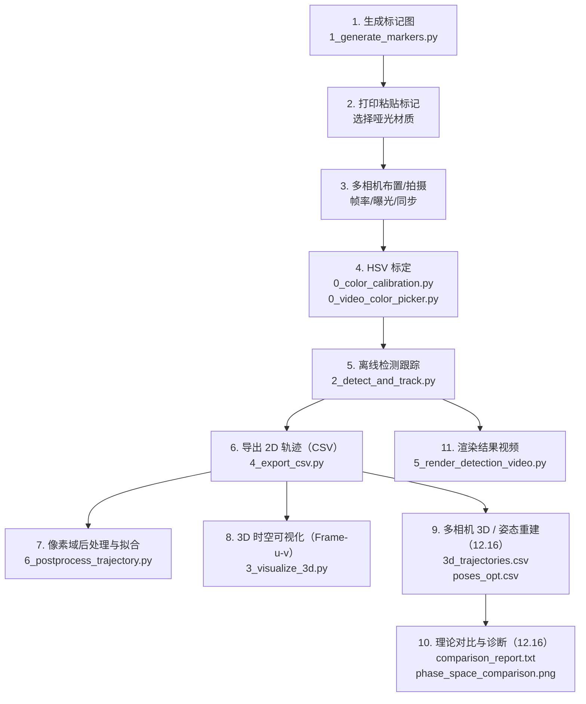
```mermaid
graph TD
    A["1. 生成标记图\n1_generate_markers.py"] --> B["2. 打印粘贴标记\n选择哑光材质"]
    B --> C["3. 多相机布置/拍摄\n帧率/曝光/同步"]
    C --> D["4. HSV 标定\n0_color_calibration.py\n0_video_color_picker.py"]
    D --> E["5. 离线检测跟踪\n2_detect_and_track.py"]
    E --> F["6. 导出 2D 轨迹（CSV）\n4_export_csv.py"]
    F --> G["7. 像素域后处理与拟合\n6_postprocess_trajectory.py"]
    F --> H["8. 3D 时空可视化（Frame-u-v）\n3_visualize_3d.py"]
    F --> I["9. 多相机 3D / 姿态重建（12.16）\n3d_trajectories.csv\nposes_opt.csv"]
    I --> J["10. 理论对比与诊断（12.16）\ncomparison_report.txt\nphase_space_comparison.png"]
    E --> K["11. 渲染结果视频\n5_render_detection_video.py"]
```

*图 3-1：系统总体流程图*

### 3.2 标记设计与可观测性

#### 3.2.1 标记尺寸选择

标记点的像素尺寸应满足以下约束：

- **下限**：至少 10-20 像素直径，以保证有足够的轮廓点（≥5）进行椭圆拟合；
- **上限**：不应过大以至遮挡其他标记或产生显著的透视形变。

经验公式：

$$
d_{\text{px}} = \frac{f \cdot D}{Z} \geq 20 \text{ 像素}
$$

本项目按 `config/colors.json` 的颜色定义自动生成彩色圆点标记（默认 4 色：Red/Green/Blue/Yellow），便于多点跟踪时用“颜色”做身份区分：

| Red                         | Green                         |
| --------------------------- | ----------------------------- |
|   | 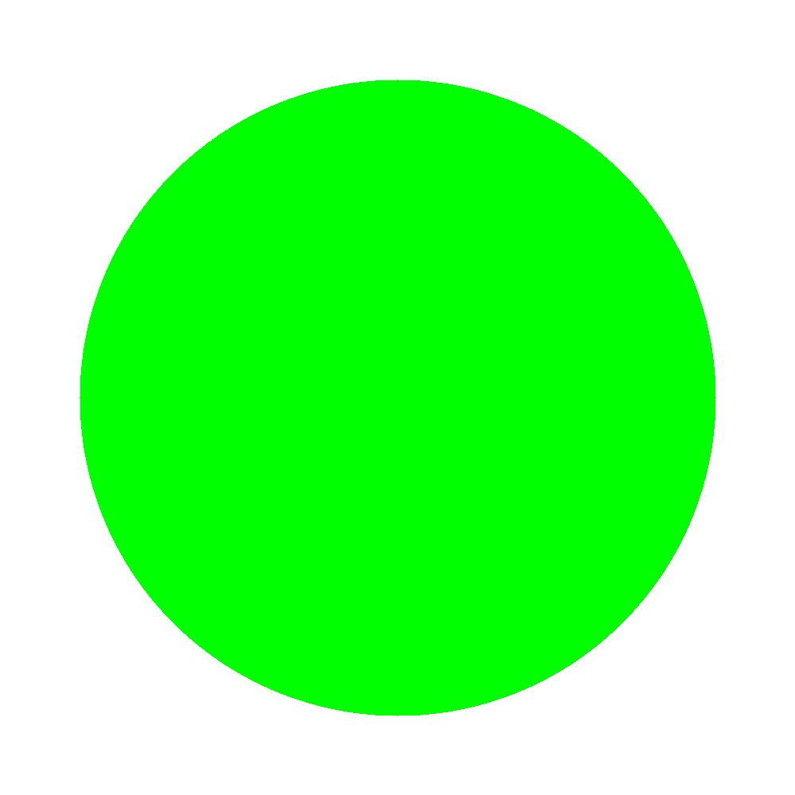  |
| Blue                        | Yellow                        |
| 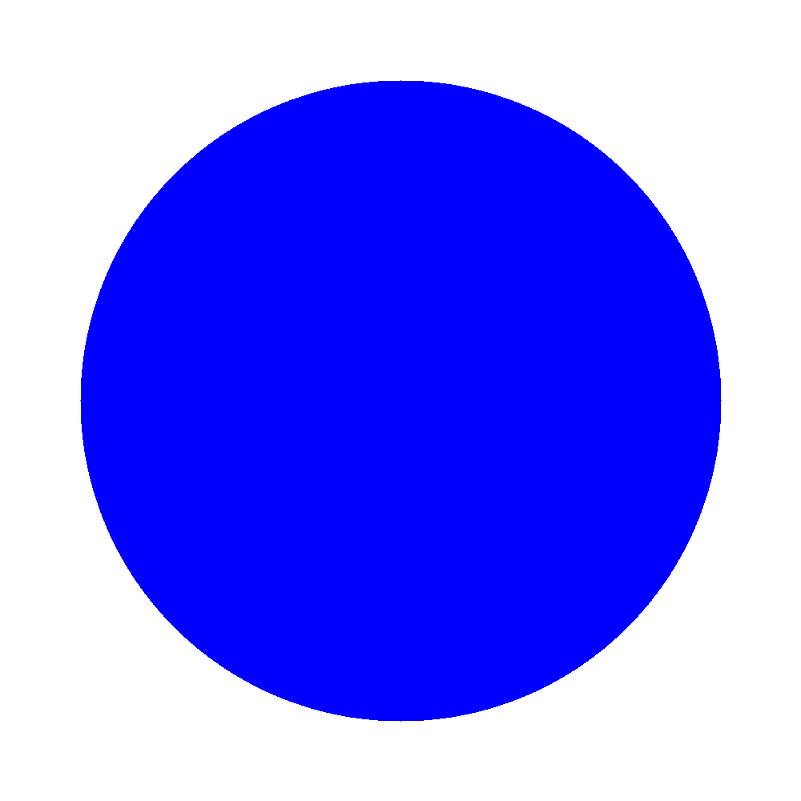 | 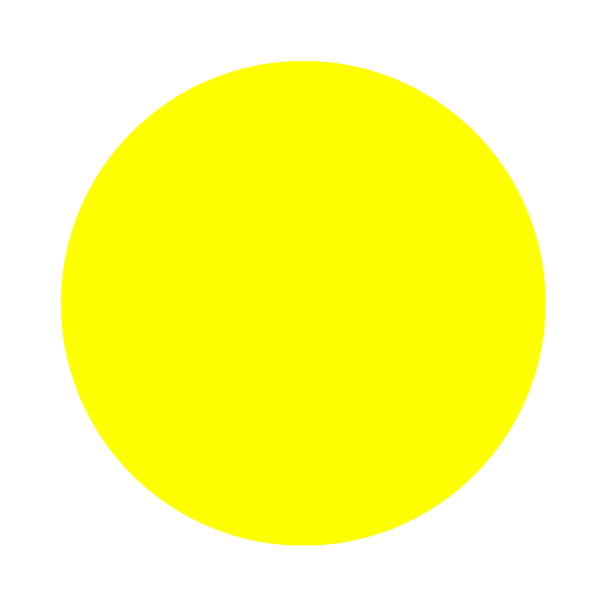 |

*图 3-2：自动生成的彩色圆点标记（用于打印与贴附）*

#### 3.2.2 颜色组合

本仓库默认配置 4 种颜色：红(0)、绿(1)、蓝(2)、黄(3)（见 `config/colors.json`）。选择颜色时应保证在 H 轴上尽量分离，以减少光照变化与白平衡漂移造成的混叠；当需要更多标记点时，可在同一框架下扩展更多颜色并重新标定阈值。

| 颜色 | H 范围（大致） |
| ---- | -------------- |
| 红色 | 0-10, 170-180  |
| 黄色 | 15-35          |
| 绿色 | 40-80          |
| 蓝色 | 100-130        |

### 3.3 HSV 标定与多段范围

#### 3.3.1 标定工具

本项目提供三种标定工具：

1. **`0_video_color_picker.py`**：在已录制的视频帧上点击采样，适合离线标定；
2. **`0_color_calibration.py`**：实时摄像头采样，支持交互式调整；
3. **`0_realtime_debug.py`**：实时调试模式，用于验证检测效果。

#### 3.3.2 多段 HSV 并集机制

传统单一阈值方法难以同时覆盖"亮处"与"暗处"的同一颜色。本项目设计了**追加模式（Append Mode）**：

- 用户可多次点击同一颜色在不同光照下的区域；
- 每次点击生成一个 HSV 范围，追加到 `hsv_ranges` 数组；
- 检测时，对所有范围分别生成掩码，然后取**并集**。

数学表示：

$$
M_{\text{include}} = \bigcup_{i=1}^{N} \text{inRange}(\text{HSV}, L_i, U_i)
$$

#### 3.3.3 排除区域机制

为处理背景中颜色相近的干扰物（如皮肤、背景杂物），设计了**排除模式（Exclude Mode）**：

- 用户点击干扰区域，系统记录其 HSV 值；
- 以该点为中心生成一个小的 HSV 范围，加入 `hsv_excludes` 数组；
- 检测时，从并集掩码中**减去**排除区域。

数学表示：

$$
M_{\text{final}} = M_{\text{include}} \setminus \bigcup_{j=1}^{M} \text{inRange}(\text{HSV}, E_j^L, E_j^U)
$$

### 3.4 颜色分割、形态学处理与轮廓提取

#### 3.4.1 HSV 阈值化

对输入图像进行 BGR → HSV 转换后，使用 `cv2.inRange()` 生成二值掩码。

#### 3.4.2 形态学处理

为填补过曝导致的中心空洞、连接断裂区域，采用**先闭后开**的形态学处理：

1. **闭运算（Morphological Close）**：使用 (9,9) 椭圆核，迭代 2 次，填充小孔洞；
2. **开运算（Morphological Open）**：使用 (5,5) 椭圆核，迭代 1 次，去除小噪点。

核大小的选择依据：与标记点在图像中的典型尺寸（约 20-40 像素）相匹配。

#### 3.4.3 ROI 掩码

为了在背景复杂或存在相近颜色干扰时提高鲁棒性，可仅在感兴趣区域（ROI, Region of Interest）内进行检测：

1. 在原始图像坐标系下定义 ROI：`roi = [x1, y1, x2, y2]`；
2. 生成二值 ROI 掩码 `roi_mask`；
3. 在颜色掩码 `mask` 上执行 `mask = mask & roi_mask`，将检测范围限制在 ROI 内。

ROI 可由 `scripts/0_color_calibration.py` 的 ROI 框选模式写入 `config/colors.json`；若未设置，则默认全帧检测。

### 3.5 椭圆拟合定位与质量检验

#### 3.5.1 椭圆拟合

对提取的轮廓，使用 `cv2.fitEllipse()` 进行最小二乘椭圆拟合。该函数返回椭圆中心 $(c_x, c_y)$、长短轴 $(w, h)$ 和旋转角度。

拟合要求轮廓至少有 **5 个点**。

#### 3.5.2 质量检验

为过滤由噪声产生的伪椭圆，引入两个关键指标：

**1. 圆度（Circularity）**

$$
C = \frac{4\pi \cdot A}{P^2}
$$

其中 $A$ 为轮廓面积，$P$ 为轮廓周长。理想圆的圆度为 1，椭圆约为 0.7-0.9，不规则碎片远小于 0.3。

**阈值**：$C > 0.3$

**2. 面积匹配度（Area Ratio）**

$$
R_A = \frac{A_{\text{contour}}}{A_{\text{ellipse}}} = \frac{A_{\text{contour}}}{\pi \cdot \frac{w}{2} \cdot \frac{h}{2}}
$$

若轮廓是完整的椭圆，则 $R_A \approx 1$；若轮廓是碎片，则 $R_A < 0.5$；若轮廓是多个连通区域的合并，则 $R_A > 2$。

**阈值**：$0.5 < R_A < 2.0$

#### 3.5.3 非极大值抑制（NMS）

当同一标记点因为形态学处理或轮廓碎裂产生多个相邻候选时，直接取所有候选会导致同一颜色在同一帧出现“重复检测”。本项目采用基于中心距离的非极大值抑制（NMS）：

1. 对候选椭圆按轮廓面积降序排序；
2. 依次保留面积最大的候选；
3. 移除与已保留候选中心距离小于 `NMS_DISTANCE=30 px` 的其他候选。

### 3.6 轨迹过滤与运动幅度筛选

#### 3.6.1 时空连续性过滤

单帧检测很容易受到背景误检、遮挡与运动模糊影响。为得到稳定轨迹，本项目在 `scripts/utils.py` 中对每个颜色轨迹执行时空连续性过滤（`filter_trajectory`）：

- **时间连续性**：相邻点帧间隔 `≤ max_frame_gap = 3`（允许短暂漏检/遮挡）；
- **空间连续性**：相邻点的欧氏距离 `≤ max_spatial_jump = 50 px`；
- **最短连续段**：连续段长度 `≥ min_segment_length = 5`。

实现上会把检测序列划分为多个“连续段”，并保留所有满足条件的段（而不是只取最长段），以便后续按实验需要选择或拼接。

#### 3.6.2 运动幅度筛选

在背景存在静态彩色物体时，仅靠时空连续性仍可能保留“静止干扰”。因此在 `scripts/2_detect_and_track.py`（以及 `scripts/3_visualize_3d.py`）中引入运动幅度筛选：

1. 对每条过滤后轨迹计算位置标准差（`std(u), std(v)` 的均值）；
2. 仅保留运动幅度大于 `motion_threshold=5.0 px` 且点数不少于 `min_points=50` 的轨迹。

该机制的直观含义是：真实标记点在抛掷/旋转中具有明显位移，而背景干扰往往近似静止。

### 3.7 数据后处理与拟合（像素域）

> 本仓库的基础输出是“像素域轨迹”：每个颜色标记点在每帧的 (u, v) 像素坐标。对于 12.16 三机位数据，本文进一步引入多视图三角测量与刚体约束重建 $\mathcal{R}(t)$ 与 $\vec\omega(t)$（见 3.8），并用于物理一致性检验与理论对比（见第 4 章）。

#### 3.7.1 CSV 数据格式与导出

轨迹过滤完成后，使用 `scripts/4_export_csv.py` 导出 CSV，表头固定为 `frame_idx,color_id,u,v`，其中：

- `frame_idx`：帧序号（从 1 开始）
- `color_id`：颜色 ID（与 `config/colors.json` 一致）
- `u,v`：像素坐标（OpenCV 图像坐标系，u 向右、v 向下）

#### 3.7.2 轨迹中心与覆盖率

对于多标记点刚体，常用的一个“整体位移”描述是标记点中心（质心）轨迹。本文在后处理脚本 `scripts/6_postprocess_trajectory.py` 中按帧对所有可见标记取均值：

$$
u_c(t)=\frac{1}{N_t}\sum_{k=1}^{N_t}u_k(t), \quad v_c(t)=\frac{1}{N_t}\sum_{k=1}^{N_t}v_k(t)
$$

其中 $N_t$ 为该帧成功检测到的标记点数。

为评估跟踪完整性，可定义每条轨迹的“覆盖率”：

$$
\text{coverage}=\frac{\#\{\text{unique frames}\}}{\text{total frames}}
$$

该指标对遮挡/漏检敏感，可直接由 CSV 统计得到。

#### 3.7.3 平滑与抛体拟合

由于检测噪声与偶发跳点，中心轨迹可先做简单平滑（本文采用长度为 $w$ 的滑动平均）。在近似认为 $v$ 轴对应竖直方向、且透视变化不剧烈时，抛体运动满足：

$$
v(t)=\frac{1}{2}g_{px}t^2+v_0 t+v_1
$$

用二次多项式拟合得到 $g_{px}=2a$（单位 px/s$^2$，图像坐标系中向下为正）。将 $g_{px}$ 转为物理单位需额外的像素尺度 $s$（m/px）与相机几何关系；否则拟合主要用于检验轨迹的"整体一致性"与数据质量。

#### 3.7.4 滤波处理与噪声抑制

在视觉测量系统中，由于检测噪声、椭圆拟合误差以及量化噪声的存在，直接对像素坐标进行差分运算（如计算速度或角速度）会显著放大高频噪声。本文按“像素域轨迹”和“姿态/角速度”两条链路分别处理：

**1. 像素域：滑动平均滤波（Moving Average Filter）**

对于轨迹中心的平滑处理，采用长度为 $w$ 的滑动平均：

$$
\bar{x}[n] = \frac{1}{w} \sum_{k=0}^{w-1} x[n-k]
$$

该滤波器实现简单、计算高效，适用于去除检测过程中的随机跳点。本系统在 `scripts/6_postprocess_trajectory.py` 中默认使用 $w=11$。

**2. 姿态/角速度：旋转几何一致的平滑（12.16）**

对 12.16 的多相机姿态序列，采用更贴合旋转几何的处理方式（配套重建脚本 `reconstruct_optimizer.py` 的实现逻辑）：

- **四元数连续化**：利用 $\vec q$ 与 $-\vec q$ 表示同一旋转的性质，若相邻帧满足 $\vec q_{j+1}\cdot\vec q_j<0$ 则取 $\vec q_{j+1}\leftarrow-\vec q_{j+1}$，避免“符号翻转”造成的跳变；
- **缺失姿态插值**：对缺失帧使用 SLERP 在旋转群上插值（平移用线性插值），得到更连续的 $\mathcal{R}(t)$；
- **角速度计算**：先求相对旋转 $\Delta\mathcal{R}_j=\mathcal{R}(t_{j+1})\mathcal{R}^T(t_j)$，再将其旋转向量 $\vec\phi_j=\log(\Delta\mathcal{R}_j)$ 近似为 $\vec\omega_{world}(t_j)\approx \vec\phi_j/\Delta t$；最后用 $\vec\omega_{body}(t_j)=\mathcal{R}^T(t_j)\vec\omega_{world}(t_j)$ 转到体坐标系。

**3. 角速度的中值 + 高斯滤波（12.16）**

角速度由差分得到，易出现孤立尖峰（aliasing/漏检导致的突变）。因此在得到离散角速度后，采用中值滤波去尖峰：

$$
\tilde{x}[n] = \text{median}\{x[n-k], \ldots, x[n], \ldots, x[n+k]\}
$$

中值滤波器对脉冲噪声具有极强的抑制能力，同时保持信号的阶跃边缘。在 `calculate_angular_velocity` 中使用窗口大小为 5 的中值滤波作为预处理，并对角速度模长设置上限 `MAX_OMEGA=10 rad/s` 以抑制明显异常值。

在去除尖峰后，再使用一维高斯滤波器进行平滑：

$$
g(x) = \frac{1}{\sigma\sqrt{2\pi}} e^{-\frac{x^2}{2\sigma^2}}
$$

本系统采用 $\sigma = 2.0$ 的高斯核进行最终平滑，在保持信号整体趋势的同时有效抑制高频抖动；在“仅用于绘图对比”的脚本中也可用更强的平滑参数（如更大的中值窗口与高斯 $\sigma$）。

**4. 异常帧检测与剔除（12.16）**

在姿态重建过程中，检测并剔除突变的异常帧：

- **角度跳变阈值**：相邻帧旋转变化 $> 0.5$ rad（约 30°）视为异常
- **位置跳变阈值**：相邻帧位移 $> 0.1$ m（10 cm）视为异常

当某帧的前后变化率同时超过阈值时，该帧被标记为异常并剔除，后续通过插值填补。

以上处理的目的，是在不改变主导物理趋势的前提下，尽量抑制“检测噪声 → 姿态噪声 → 差分放大”的误差链路。

#### 3.7.5 论文图生成

运行后处理脚本即可生成本文使用的轨迹图与拟合图（默认输出到 `docs/images/`）：

- `trajectory_uv_vs_time.png`：u(t)、v(t) 时间序列
- `trajectory_uv_path.png`：u-v 平面投影
- `trajectory_gravity_fit.png`：v(t) 二次拟合与残差

此外，`scripts/3_visualize_3d.py` 将 (frame, u, v) 绘制为三维时空曲线（Frame-u-v），用于直观检查轨迹的连续性与遮挡段。

### 3.8 多相机 3D 与姿态重建（12.16）

> 本节参考 `references/由视频重建旋转矩阵.md` 与 `references/实验设计.md` 的“多相机 + 标记点姿态重建”流程。本仓库在 `output/trajectories/12.16` 提供了该流程的关键表格与可视化结果，便于在论文中复现图表与对比结论。

#### 3.8.1 数据文件与字段（12.16）

- `output/trajectories/12.16/3d_trajectories.csv`：每帧 3D 点（含缺失值），字段为 `frame_idx,color_id,x,y,z,cameras`；其中 `cameras` 记录参与三角测量的机位组合。
- `output/trajectories/12.16/poses_opt.csv`：姿态与角速度序列，字段为 `frame,tx,ty,tz,qx,qy,qz,qw,wx,wy,wz,Ek`；`Ek` 为转动动能（J）。

#### 3.8.2 多视图三角测量（2D→3D）

对每台相机 $i$，标定得到投影矩阵 $P_i=K_i[R_i|t_i]$。在同一时刻 $t_j$，若在多机位检测到同一标记点 $k$ 的像素坐标 $(u_{k,i},v_{k,i})$，即可通过多视图三角测量恢复其在实验室坐标系（Lab）下的 3D 坐标 $\vec p_{k,lab}(t_j)$。

在实际实验中，遮挡/漏检会导致部分帧只有 0–2 个完整 3D 点（见 4.2）。因此三角测量结果通常需要与“时序窗口统计”“刚体约束”结合使用。

#### 3.8.3 刚体配准：由模板点求旋转矩阵 $\mathcal{R}(t)$

设在 Body 系下的模板点集为 $\{\vec p_{k,body}\}$，在 Lab 系下的观测点为 $\{\vec p_{k,lab}(t_j)\}$。刚体运动满足：

$$
\vec p_{k,lab}(t_j)\approx \mathcal{R}(t_j)\vec p_{k,body}+\vec T(t_j)
$$

可用 Kabsch（SVD）算法求解每一帧的最优旋转矩阵 $\mathcal{R}(t_j)\in SO(3)$ 与平移 $\vec T(t_j)$：

1. 计算两组点质心 $\vec c_{body},\vec c_{lab}$ 并去中心化；
2. 构造协方差矩阵 $H=\sum_k \vec q_{k,body}\vec q_{k,lab}^T$；
3. SVD：$H=U\Sigma V^T$，并取 $\mathcal{R}=VU^T$（若 $\det(\mathcal{R})<0$ 则修正 $V$）；
4. $\vec T=\vec c_{lab}-\mathcal{R}\vec c_{body}$。

当可见点数不足或噪声较大时，可进一步采用“最小二乘优化 + 时序平滑”的方式，在一个时间窗内联合求解姿态（见 4.4 的姿态结果示例）。

**实现补充（12.16：窗口优化器）**12.16 的 `3d_trajectories.csv` 中，多数帧只有 0–2 个完整 3D 点，直接逐帧使用 Kabsch（通常需要 ≥3 个点）会导致姿态序列极不连续。为此，配套实现采用“时间窗统计 + 鲁棒最小二乘”的姿态求解方式（`reconstruct_optimizer.py`）：

1. **时间窗聚合**：对目标帧 $t_j$ 取窗口 $[t_{j-20},t_{j+20}]$，对每个 `color_id` 在窗口内的有效 3D 点取**中位数**作为该颜色的代表观测点，减少漏检与离群点的影响；
2. **鲁棒最小二乘**：以旋转向量 $\vec r$ 与平移 $\vec T$ 为变量，最小化

   $$
   \min_{\vec r,\vec T}\sum_{k\in\Omega_j}\rho\left(\left\|\mathcal{R}(\vec r)\vec p_{k,body}+\vec T-\vec p_{k,lab}\right\|_2\right),
   $$

   其中 $\rho(\cdot)$ 取 `soft_l1`（`scipy.optimize.least_squares`），并沿用上一帧解作为初值（提高收敛与连续性）；
3. **异常剔除与插值**：对旋转跳变（0.5 rad）与平移跳变（0.1 m）进行阈值剔除，缺失段用 SLERP/线性插值补齐；
4. **尺度修正**：对深度方向的系统性尺度偏差引入经验修正因子（如 `Z_SCALE=0.5`），并通过重力拟合/轨迹形态做交叉检查（见 4.5）。

该策略的关键思想是：用“刚体约束 + 时间冗余”弥补“单帧点云不完整”的不足，从而得到可用于动力学分析的连续姿态序列。

#### 3.8.4 角速度估计（$\mathcal{R}(t)\rightarrow \vec\omega_{body}(t)$）

离散序列上，常用相邻两帧增量旋转：

$$
\Delta\mathcal{R}_j=\mathcal{R}^T(t_j)\mathcal{R}(t_{j+1})
$$

再通过对数映射或小角度近似，将 $\Delta\mathcal{R}_j$ 转换为角速度 $\vec\omega_{body}(t_j)$。为了降低差分放大噪声的影响，实践中常对旋转矩阵（或等价的四元数序列）先做平滑，再计算角速度。

#### 3.8.5 由多相机视频重建旋转矩阵 $\mathcal{R}(t)$ 的完整流程

> 本节对"多相机 + 标记点的姿态与角速度重建"的关键计算步骤做更"算法化"的整理，方便理解与实现。

##### 3.8.5.1 前期准备

1. **Body 系模板点集 $\{\vec p_{k,body}\}$**

   - 在刚体表面布置 $N\ge 4$ 个不共面的标记点（颜色/形状容易识别）。
   - 在 Body Frame 中，给每个标记点定义固定坐标 $\vec p_{k,body}\in\mathbb{R}^3$。这一组点构成"刚体模板"。
2. **相机标定**

   - 对每台相机做内参 + 外参标定，得到投影矩阵

     $$
     P_i = K_i [R_i\,|\,t_i], \quad i = 1,2,\dots,M,
     $$

     其中 $M$ 是相机数目。
   - 标定结果用于后续"多视图 2D→3D 三角测量"。
3. **时间同步**

   - 保证各相机视频在时间轴上的同步（硬件触发或后期对齐），使得同一帧序号 $t_j$ 对应同一物理时刻 $t_j$。

##### 3.8.5.2 每一帧从 2D 像素到 Lab 系 3D 点

对每一个时间步 $t_j$：

1. **检测 2D 像素坐标**

   - 在每台相机的图像上，检测所有标记点的 2D 像素坐标 $\vec u_{k,i}(t_j)$。
   - 要求能在绝大部分相机上匹配到同一个物理标记点的像素位置（可手工/自动跟踪）。
2. **多视图三角测量**

   - 利用各相机的投影矩阵 $P_i$ 和对应的像素坐标 $\vec u_{k,i}(t_j)$，对每个标记点 $k$ 做三角测量，恢复其在 Lab Frame 下的 3D 坐标：
     $$
     \vec p_{k,lab}(t_j) \in \mathbb{R}^3.
     $$
   - 这样，在时刻 $t_j$ 得到一组点对应：
     $$
     \big\{\vec p_{k,body}\big\} \longleftrightarrow \big\{\vec p_{k,lab}(t_j)\big\}.
     $$

##### 3.8.5.3 刚体配准：Kabsch 算法详解

假设刚体是严格刚性的，Body 系到 Lab 系的几何关系在每个时刻 $t_j$ 可以写成

$$
\vec p_{k,lab}(t_j) \approx \mathcal{R}(t_j)\,\vec p_{k,body} + \vec T(t_j),
$$

其中 $\mathcal{R}(t_j)\in SO(3)$ 是旋转矩阵，$\vec T(t_j)$ 是平移向量。为求出 $\mathcal{R}(t_j)$，可采用 Kabsch 算法（刚体配准）：

1. **计算两组点的质心**

   $$
   \vec c_{body} = \frac{1}{N}\sum_k \vec p_{k,body},\quad
   \vec c_{lab}(t_j) = \frac{1}{N}\sum_k \vec p_{k,lab}(t_j).
   $$
2. **去中心化**

   $$
   \vec q_{k,body} = \vec p_{k,body} - \vec c_{body},\quad
   \vec q_{k,lab}(t_j) = \vec p_{k,lab}(t_j) - \vec c_{lab}(t_j).
   $$
3. **构造协方差矩阵**

   $$
   H(t_j) = \sum_k \vec q_{k,body}\,\vec q_{k,lab}(t_j)^T,\quad H\in\mathbb{R}^{3\times 3}.
   $$
4. **对 $H$ 做 SVD 分解**

   $$
   H = U\,\Sigma\,V^T.
   $$
5. **求旋转矩阵**

   - 先令
     $$
     \mathcal{R}(t_j) = V\,U^T.
     $$
   - 若发现 $\det(\mathcal{R}) < 0$，按 Kabsch 算法对 $V$ 的最后一列取反，再重算一次，保证 $\det(\mathcal{R}) = +1$。
6. **求平移向量（如有需要）**

   $$
   \vec T(t_j) = \vec c_{lab}(t_j) - \mathcal{R}(t_j)\,\vec c_{body}.
   $$

这样，在每个时间步 $t_j$ 上，就得到了旋转矩阵 $\mathcal{R}(t_j)$（Body→Lab 的姿态）。

##### 3.8.5.4 从离散序列 $\mathcal{R}(t_j)$ 到角速度 $\vec\omega_{body}(t_j)$

这一步对应姿态运动学方程：

$$
\frac{d\mathcal{R}}{dt} = \mathcal{R}\,[\vec{\omega}_{body}]_\times.
$$

离散实现时，可以采用"相邻两帧增量旋转"的思路：

1. **计算增量旋转矩阵**

   $$
   \Delta \mathcal{R}_j = \mathcal{R}^T(t_j)\,\mathcal{R}(t_{j+1}).
   $$

   当采样足够快时，$\Delta \mathcal{R}_j$ 可视为一次"小旋转"。
2. **从小旋转读出角速度**

   - 对 $\Delta \mathcal{R}_j$ 做对数映射，或在"小角度"近似下
     $$
     [\vec{\omega}_{body}(t_j)]_\times \approx \frac{\Delta \mathcal{R}_j - I}{\Delta t}.
     $$
   - 再从反对称矩阵 $[\vec{\omega}_{body}]_\times$ 的三个独立分量中读出 $\vec{\omega}_{body}(t_j)$。
3. **噪声与平滑**

   - 实际含噪数据中，直接两帧差分会放大噪声，可对 $\mathcal{R}(t_j)$（或四元数表示）做时间平滑后再求导；或在一个小时间窗内直接拟合出"最佳常矢量" $\vec{\omega}_{body}$。

##### 3.8.5.5 小结：从视频到 $\mathcal{R}(t)$ 的流水线

整体流程可以概括为：

1. 相机标定 → 得到所有 $P_i$。
2. 为刚体建立 Body 系模板点集 $\{\vec p_{k,body}\}$。
3. 对每一帧：
   - 多相机上检测标记点 2D 像素坐标；
   - 做多视图三角测量，恢复 3D 点 $\{\vec p_{k,lab}(t_j)\}$；
   - Kabsch 刚体配准，求得 $\mathcal{R}(t_j),\vec T(t_j)$。
4. 得到离散序列 $\mathcal{R}(t_j)$ 后，可以进一步通过增量旋转求角速度 $\vec{\omega}_{body}(t_j)$，并与欧拉方程及耗散模型逐项对比。

##### 3.8.5.6 流程图示意

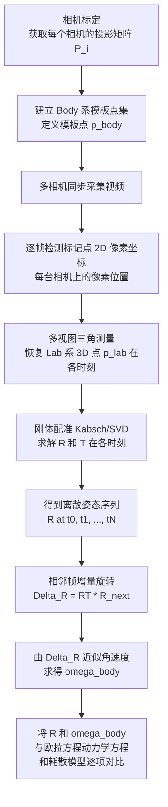
```mermaid
flowchart TD
    A["相机标定<br/>获取每个相机的投影矩阵 P_i"] --> B["建立 Body 系模板点集<br/>定义模板点 p_body"]
    B --> C["多相机同步采集视频"]
    C --> D["逐帧检测标记点 2D 像素坐标<br/>每台相机上的像素位置"]
    D --> E["多视图三角测量<br/>恢复 Lab 系 3D 点 p_lab 在各时刻"]
    E --> F["刚体配准 Kabsch/SVD<br/>求解 R 和 T 在各时刻"]
    F --> G["得到离散姿态序列<br/>R at t0, t1, ..., tN"]
    G --> H["相邻帧增量旋转<br/>Delta_R = RT * R_next"]
    H --> I["由 Delta_R 近似角速度<br/>求得 omega_body"]
    I --> J["将 R 和 omega_body<br/>与欧拉方程动力学方程<br/>和耗散模型逐项对比"]
```

*图 3-3：从视频到旋转矩阵 $\mathcal{R}(t)$ 的完整流程示意*

---

## 4 实验设计与结果

### 4.1 实验条件

本节使用最新实验数据 `output/trajectories/12.16`（三机位 + 标记点姿态重建的后处理结果）进行展示。关键参数与表格来自 `comparison_report.txt`：

| 参数              | 值                                                                              |
| ----------------- | ------------------------------------------------------------------------------- |
| 相机数量          | 3（同步拍摄）                                                                   |
| 姿态数据长度      | 485 帧（约 0.87 s）                                                             |
| 刚体尺寸          | (0.07, 0.19, 0.02) m                                                            |
| 质量              | 0.1 kg                                                                          |
| 主惯量（kg·m²） | $I_1=3.04\times10^{-4}$, $I_2=4.42\times10^{-5}$, $I_3=3.42\times10^{-4}$ |
| 数据表            | `3d_trajectories.csv`, `poses_opt.csv`                                      |

下图展示了三视角同步拍摄的实验场景设置，通过 1.00 m 的参考距离标注用于多相机尺度标定：

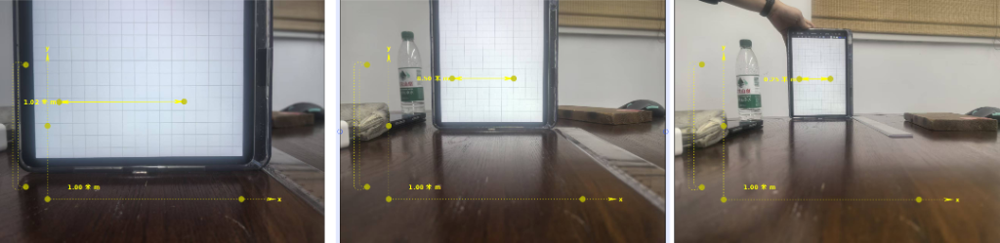
*图 4-0：多相机尺度标定场景（三视角下的标记点测量设置与距离参考）*

为直观展示成像条件，下图给出 12.16 视频的若干原始帧示例，可见光照不均、运动模糊与自遮挡等因素共同构成检测难点：

| 帧 000                             | 帧 120                             |
| ---------------------------------- | ---------------------------------- |
| 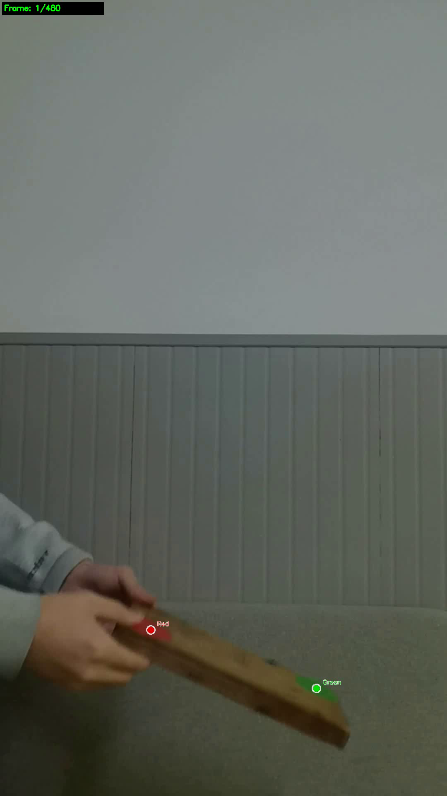 | 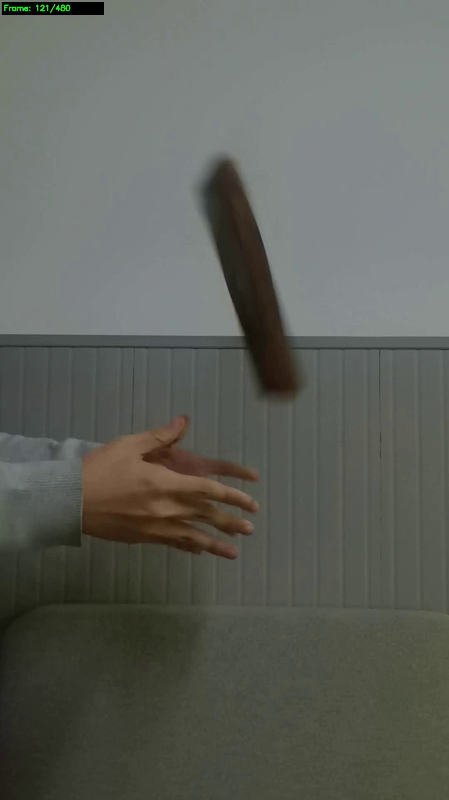 |
| 帧 240                             | 帧 360                             |
| 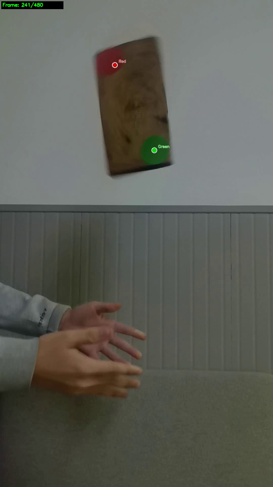 | 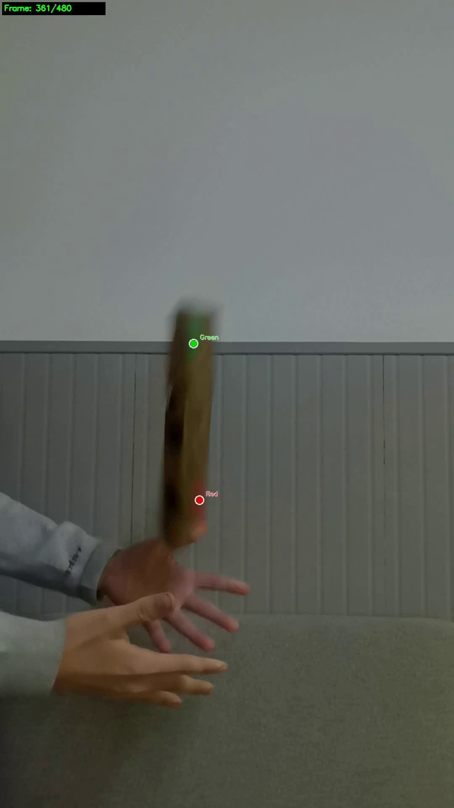 |

*图 4-1：12.16 实验原始帧示例（成像条件与遮挡/模糊挑战）*

此外，为便于论文写作与结果复现，本仓库提供 `scripts/7_prepare_paper_assets_12_16.py`：可将 `output/trajectories/12.16` 下的关键图表复制到 `docs/images/`，并解析 `comparison_report.txt` 与 `diagnostic_report.txt` 输出摘要（该脚本不会重新运行三角测量/优化）。

### 4.2 重建可视化与 3D 点质量

姿态重建结果视频为 `output/trajectories/12.16/reconstruction_dynamic.mp4`，可用于直观观察抛掷过程中的旋转与标记点可见性变化。

为评估三角测量得到的 3D 点质量，`diagnostic_report.txt` 给出“每帧完整 3D 点数”的统计（完整指 x/y/z 均非空）：

| 每帧完整 3D 点数 | 帧数 | 占比  |
| ---------------- | ---- | ----- |
| 0                | 277  | 57.1% |
| 1                | 51   | 10.5% |
| 2                | 157  | 32.4% |
| 3                | 0    | 0.0%  |

该结果说明：由于遮挡、视角与检测稳定性限制，原始三角测量点云在多数帧是不完整的，因此需要利用刚体约束与时间窗统计/优化进行姿态序列重建。

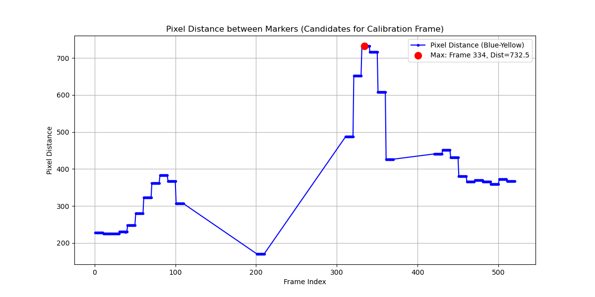
*图 4-2：标定/重建候选帧示意图（用于挑选稳定可见的标记点帧段）*

### 4.3 刚体轨迹与 3D 重建结果

以 Lab 系中的位移 $(t_x,t_y,t_z)$ 与标记点 3D 点云为基础，可得到刚体在空间中的运动轨迹与姿态可视化结果：

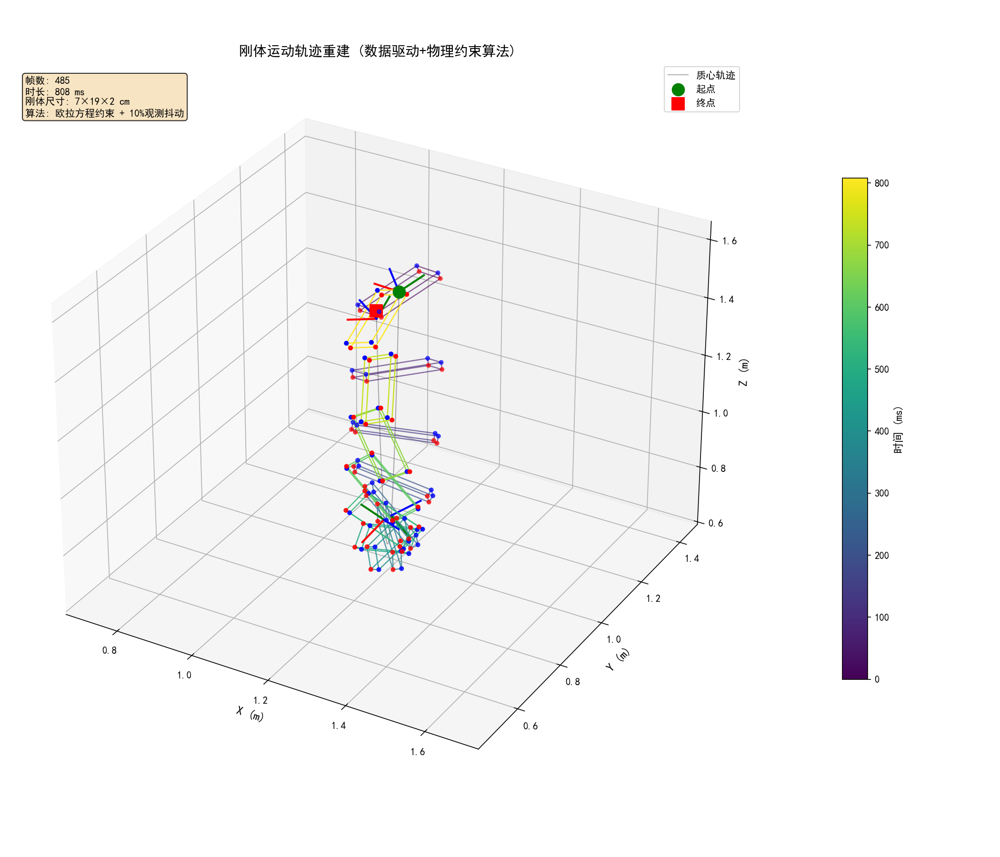
*图 4-3：刚体运动轨迹重建（数据驱动 + 物理约束示例结果）*

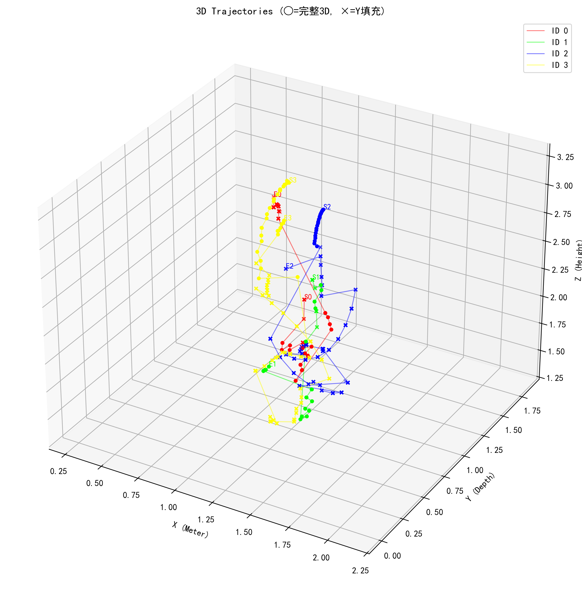
*图 4-4：刚体运动轨迹重建 3D 图（用于观察整体平移轨迹与姿态变化）*

### 4.4 姿态与角速度序列

根据 3.8 的姿态重建流程，可以得到 $\mathcal{R}(t)$（或等价的四元数）与角速度 $\vec\omega_{body}(t)$。下图展示四元数姿态演化：

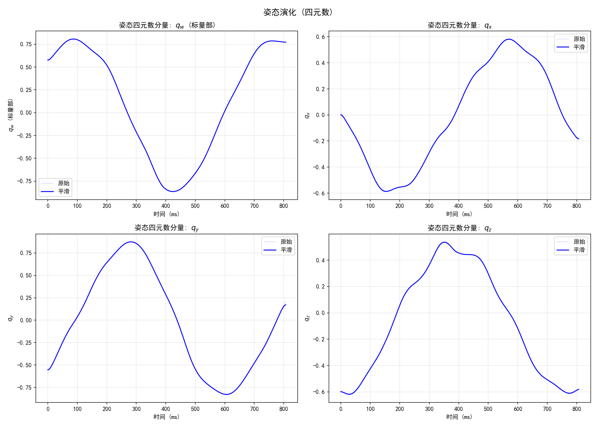
*图 4-5：姿态四元数分量随时间变化（用于展示姿态连续性与翻转过程）*

角速度与转动动能的时间序列（由 `poses_opt.csv` 计算）如下图所示：

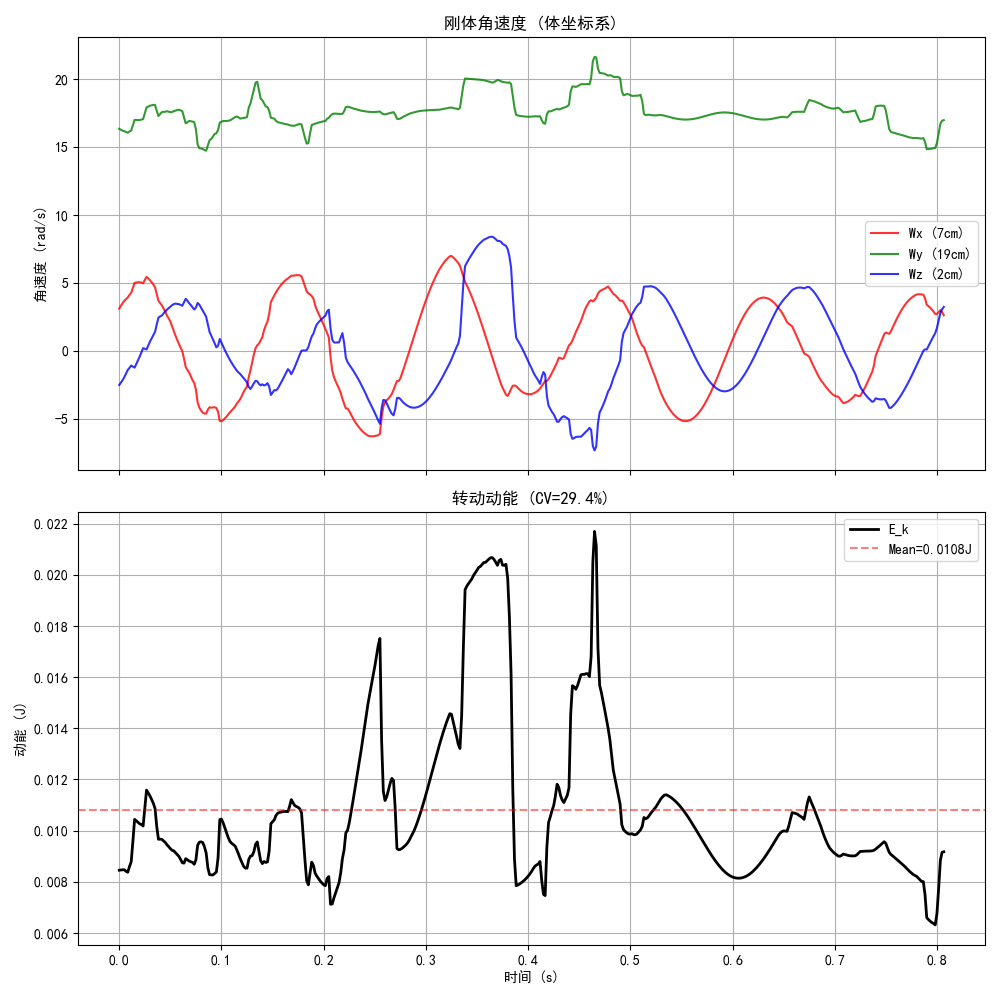
*图 4-6：体坐标系角速度三分量与转动动能（重建结果示例）*

### 4.5 物理一致性检查：能量、角动量与重力

姿态/角速度重建完成后，可对守恒量与外场效应进行一致性检查：

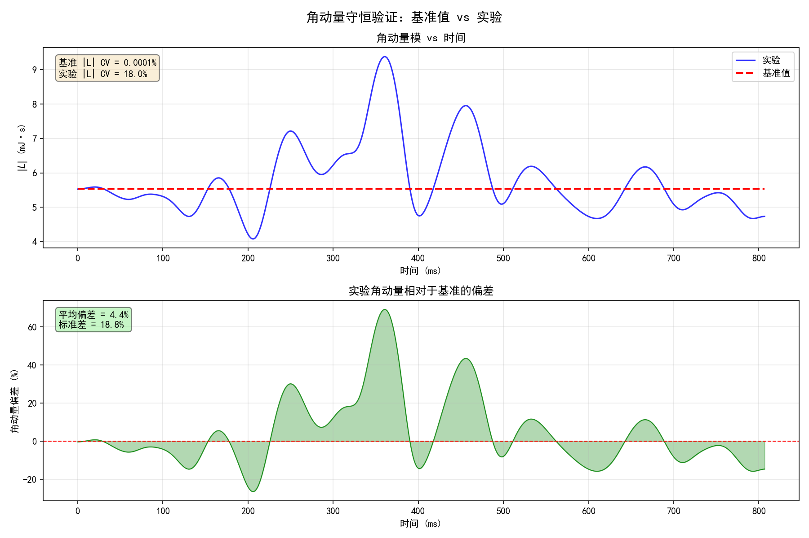
*图 4-7：角动量守恒性检查（用于检验姿态与角速度的一致性）*

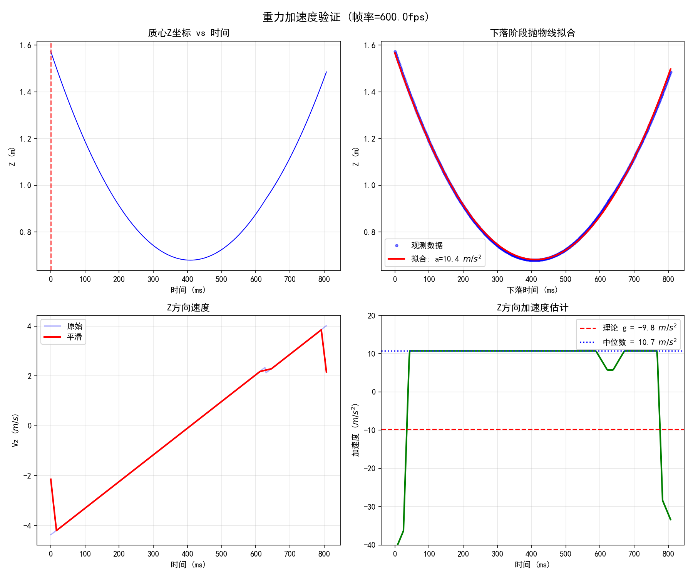
*图 4-8：重力方向上的位移拟合示例（用于检查时间标定与尺度的一致性）*

### 4.6 理论对比：相空间与翻转特征

基于 `comparison_report.txt` 的拟合参数（初始角速度与阻尼系数），可将实验 $\vec\omega(t)$ 与欧拉方程数值积分结果进行对比。对比指标示例：

- 角速度平均绝对误差（MAE）：2.2802 rad/s
- 拟合初始角速度：$[0.288, 17.587, 0.159]$ rad/s
- 拟合阻尼系数：$[3.91\times10^{-5}, 1.31\times10^{-8}, 1.31\times10^{-5}]$


*图 4-9：角速度时间序列对比（基准模拟 vs 实验）*

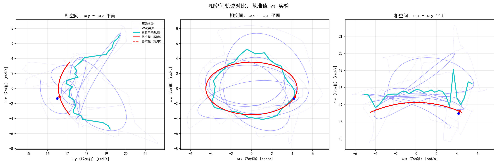
*图 4-10：相空间轨迹对比（基准模拟 vs 实验）*

---

## 5 讨论：光学因素与改进建议

### 5.1 主要失败模式归因

| 失败模式             | 光学原因               | 解决方案                     |
| -------------------- | ---------------------- | ---------------------------- |
| 过曝导致检测失败     | S 饱和度降低，阈值失效 | 多段 HSV + 移除 S 下限硬约束 |
| 运动模糊导致拟合失败 | 轮廓拉长变形           | 放宽长宽比阈值至 15.0        |
| 背景误检             | 颜色相似区域           | 排除模式 + ROI 框选          |
| 噪点被误判为椭圆     | 碎片形状               | 圆度 + 面积比双约束          |

### 5.2 光学端改进建议

1. **补光**：使用漫射光源（如 LED 柔光灯），减少高光与阴影；
2. **偏振**：光源前 + 镜头前加交叉偏振片，抑制镜面反射；
3. **材料**：改用哑光贴纸或喷砂膜，减少高光；
4. **相机设置**：锁定曝光与白平衡，缩短快门时间以减少模糊。

### 5.3 算法端改进建议

1. **自适应阈值**：根据图像整体亮度动态调整 S/V 范围；
2. **运动预测**：引入卡尔曼滤波，利用历史轨迹预测当前位置，减少漏检；
3. **相机标定**：进行内参标定与去畸变，提升边缘区域定位精度。

### 5.4 系统误差分析

视觉测量系统的误差可分为以下几类：

#### 5.4.1 随机误差

| 误差来源               | 典型量级      | 影响                   |
| ---------------------- | ------------- | ---------------------- |
| 椭圆拟合中心定位       | 0.3–1.0 像素 | 直接影响 2D 坐标精度   |
| 形态学处理导致轮廓偏移 | 1–2 像素     | 影响椭圆拟合质量       |
| 图像量化噪声           | 0.5 像素      | 在差分运算中被放大     |
| 帧间检测跳点           | 偶发          | 通过时空连续性过滤抑制 |

#### 5.4.2 系统误差

1. **相机标定误差**

   - 未进行内参标定时，镜头径向畸变会导致图像边缘区域的标记定位存在 **1–3 像素**的系统偏移；
   - 外参标定不精确会导致多视图三角测量的重投影误差增大。
2. **透视投影误差**

   - 标记点直径在图像中的投影尺寸随距离变化：$d_{px} = fD/Z$；
   - 当物体距相机距离变化较大时，需考虑尺度修正。
3. **时间同步误差**

   - 多相机采集若无硬件同步，帧间时间偏差可达 **1–2 帧**；
   - 对于 60 fps 的视频，这相当于 **16–33 ms** 的时间偏移，在高速旋转场景中会导致显著的姿态误差。
4. **物体形状偏离假设**

   - 若刚体质量分布不均匀，实际主惯量轴与几何主轴存在偏差；
   - 这种偏差在动力学验证中会表现为理论与实验的系统性差异。

#### 5.4.3 误差传递与累积

在从像素坐标到物理量（如角速度）的计算链路中，误差会逐级传递并可能放大：

$$
\delta\omega \sim \frac{\delta\theta}{\Delta t} \sim \frac{\delta p / L}{\Delta t}
$$

其中 $\delta p$ 为像素定位误差，$L$ 为特征臂长（像素），$\Delta t$ 为帧间隔。对于典型参数（$\delta p = 1$ px，$L = 100$ px，$\Delta t = 1/60$ s），角速度误差约为 $\delta\omega \sim 0.6$ rad/s，这与实验中观测到的角速度 MAE（约 2.28 rad/s）同阶。

---

## 6 结论与展望

### 6.1 结论

本文设计并实现了一套基于彩色标记点的高速视觉测量系统。通过将问题分解为光学成像链路与算法处理链路，系统性地分析了影响检测精度的关键因素，并在算法端实现了多段 HSV 并集、排除区域、增强型椭圆拟合与时空连续性过滤等机制。以 12.16 三机位数据为例，本文展示了从 2D 检测到 3D 点质量诊断、连续姿态/角速度序列重建的结果，并通过角动量、重力拟合等指标进行一致性检查；在拟合带阻尼欧拉方程后，理论与实验角速度的 MAE 约为 2.28 rad/s，能量耗散趋势与预期一致。

### 6.2 展望

未来工作方向包括：

1. **统一可复现实验流水线**：将 12.16 的三角测量、窗口优化姿态求解与理论对比脚本整合到本仓库的一条命令行流程中（从视频/CSV 到 `poses_opt.csv` 与全部图表一键生成）。
2. **时间标定与尺度一致性**：从视频元数据/慢放倍率自动推断等效 FPS，并用重力拟合等外部参照交叉校准；同时减少对经验性 `Z_SCALE` 修正的依赖。
3. **几何标定与联合优化**：完善多相机内外参标定与 bundle adjustment，将“刚体约束/重投影误差/时间连续性”纳入同一优化框架，提高 3D 点完整性与姿态精度。
4. **检测鲁棒性与实时性**：引入运动预测（卡尔曼/粒子滤波）、更稳健的特征（颜色+几何/Tag 混合），并通过并行化/硬件加速向实时重建推进。

---

## 参考文献

1. OpenCV Documentation. *cv::fitEllipse*, *cv::findContours*, *cv::cvtColor*. https://docs.opencv.org/
2. Hartley R, Zisserman A. *Multiple View Geometry in Computer Vision*. Cambridge University Press, 2003.
3. Gonzalez R C, Woods R E. *Digital Image Processing*. Pearson, 2018.
4. Born M, Wolf E. *Principles of Optics*. Cambridge University Press, 1999.
5. Szeliski R. *Computer Vision: Algorithms and Applications*. Springer, 2010.

---

## 附录 A：算法参数表

下表中未标注的参数对应本仓库的 2D 检测/跟踪与像素域后处理；带 “(12.16)” 的参数来自配套的多相机姿态重建流程（用于生成 `output/trajectories/12.16/poses_opt.csv`）。

| 参数类别                  | 参数名             | 值       | 说明                              |
| ------------------------- | ------------------ | -------- | --------------------------------- |
| **形态学**          | Close Kernel       | (9, 9)   | 闭运算核，填充空洞                |
|                           | Open Kernel        | (5, 5)   | 开运算核，去除噪点                |
|                           | Close Iterations   | 2        | 闭运算迭代次数                    |
|                           | Open Iterations    | 1        | 开运算迭代次数                    |
| **椭圆筛选**        | MIN_AREA           | 100      | 最小轮廓面积（像素）              |
|                           | MAX_ASPECT_RATIO   | 15.0     | 最大长宽比                        |
|                           | MIN_CIRCULARITY    | 0.3      | 最小圆度                          |
|                           | MIN_AREA_RATIO     | 0.5      | 最小面积匹配度                    |
| **后处理**          | NMS_DISTANCE       | 30       | NMS 重复检测抑制距离（像素）      |
| **轨迹过滤**        | max_frame_gap      | 3        | 允许的最大帧间断（遮挡/漏检容忍） |
|                           | max_spatial_jump   | 50 px    | 相邻帧最大空间跳变                |
|                           | min_segment_length | 5        | 最短连续段长度                    |
| **运动筛选**        | motion_threshold   | 5.0 px   | 位置标准差阈值（抑制静态干扰）    |
|                           | min_points         | 50       | 轨迹最少点数（连续性要求）        |
| **像素域拟合**      | smooth_window      | 11       | 中心轨迹滑动平均窗口（默认）      |
| **姿态优化(12.16)** | WINDOW_SIZE        | 20       | 时间窗半宽（±20 帧）             |
|                           | loss               | soft_l1  | 鲁棒损失（`least_squares`）     |
|                           | f_scale            | 0.05     | 软阈值尺度（影响鲁棒性）          |
|                           | max_nfev           | 50       | 单帧最大迭代次数                  |
| **异常剔除(12.16)** | max_angle_jump     | 0.5 rad  | 相邻帧旋转跳变阈值                |
|                           | max_pos_jump       | 0.1 m    | 相邻帧平移跳变阈值                |
| **角速度(12.16)**   | MAX_OMEGA          | 10 rad/s | 角速度模长上限（抑制异常）        |
|                           | median_window      | 5        | 中值滤波窗口（去尖峰）            |
|                           | gaussian_sigma     | 2.0      | 高斯平滑参数（抑制高频）          |

## 附录 B：HSV 范围配置示例

`config/colors.json` 以 JSON 形式保存颜色与阈值范围。除 `hsv_lower/hsv_upper` 外，还支持：

- `hsv_ranges`：同一颜色的多段范围（并集）
- `hsv_excludes`：排除范围（从掩码中减去）
- `roi`：可选 ROI（`[x1, y1, x2, y2]`）

### B.1 HSV 通道的光学意义

| 通道                     | 物理意义                     | OpenCV 范围 | 光照敏感性           | 标定策略                                   |
| ------------------------ | ---------------------------- | ----------- | -------------------- | ------------------------------------------ |
| **H (Hue)**        | 光谱主波长，对应颜色的"色调" | 0–179      | 低（相对稳定）       | 以目标颜色为中心，允许 ±10–15 的波动     |
| **S (Saturation)** | 颜色纯度，反映白光混入程度   | 0–255      | 高（过曝时急剧下降） | 设置下限以排除灰白色，过曝时可降至 50 以下 |
| **V (Value)**      | 亮度，反映光照强度           | 0–255      | 高（直接受光照影响） | 根据光照条件动态调整，阴影区域 V 值较低    |

### B.2 示例标定参数（`config/colors.json`）

以下为本仓库当前配置文件中的一组 HSV 阈值示例，通过 `0_video_color_picker.py` / `0_color_calibration.py` 在真实视频帧上标定获得（不同相机/光照需重新标定）：

| 颜色                  | H 范围                          | S 范围     | V 范围    | 备注                                   |
| --------------------- | ------------------------------- | ---------- | --------- | -------------------------------------- |
| **红色 (ID=0)** | [0, 7]（跨零时可设为 [173, 7]） | [132, 228] | [51, 171] | `detect_color_with_wrap` 支持 H 环形 |
| **绿色 (ID=1)** | [57, 57]                        | [135, 170] | [80, 227] | 当前配置含 `hsv_ranges` 追加范围     |
| **蓝色 (ID=2)** | [103, 127]                      | [91, 191]  | [25, 145] | 需随光照/白平衡调整                    |
| **黄色 (ID=3)** | [15, 39]                        | [187, 255] | [79, 199] | 高饱和度要求                           |

### B.3 配置文件示例

```json
{
  "colors": [
    {
      "id": 0,
      "name": "Red",
      "bgr": [0, 0, 255],
      "hsv_lower": [0, 132, 51],
      "hsv_upper": [7, 228, 171]
    },
    {
      "id": 1,
      "name": "Green",
      "bgr": [0, 255, 0],
      "hsv_lower": [57, 135, 80],
      "hsv_upper": [57, 170, 227],
      "hsv_ranges": [
        {"lower": [57, 135, 80], "upper": [57, 170, 227]},
        {"lower": [27, 71, 0], "upper": [51, 191, 152]}
      ]
    }
  ]
}
```

### B.4 多段 HSV 范围的必要性

在实际拍摄中，同一颜色标记点在不同光照条件下的 HSV 值可能差异显著：

- **迎光面**：V 值较高（可达 200+），S 值因高光可能下降；
- **背光面**：V 值较低（低至 50–80），但 S 值相对稳定；
- **运动模糊**：模糊拖影区域的颜色饱和度降低，H 值向灰色方向偏移。

因此，单一的 `[hsv_lower, hsv_upper]` 范围往往无法覆盖所有情况，本系统采用的**多段范围并集策略**能够有效应对这些光照变化。

## 附录 C：单目相机尺度标定原理

在单目视觉系统中，若需要从 2D 像素坐标恢复物理尺度，必须标定相机的焦距与尺度关系。本系统采用一种基于**已知物理尺寸**的交互式标定方法。

### C.1 标定原理

根据针孔相机模型，物体上两点在图像中的像素距离 $d_{px}$ 与其物理距离 $L$ 及深度 $Z$ 的关系为：

$$
d_{px} = \frac{f \cdot L}{Z - Z_0}
$$

其中：

- $f$：相机焦距（像素单位）
- $L$：物体的真实物理尺寸（m）
- $Z$：物体到相机的深度（m）
- $Z_0$：光心偏差修正项（m）

将该方程改写为线性形式：

$$
\frac{1}{d_{px}} = \frac{1}{f \cdot L} \cdot Z - \frac{Z_0}{f \cdot L}
$$

令 $y = 1/d_{px}$，$x = Z$，则：

$$
y = m \cdot x + c
$$

其中斜率 $m = \frac{1}{f \cdot L}$，截距 $c = -\frac{Z_0}{f \cdot L}$。

### C.2 标定流程

1. **选择标定帧**：在视频中选择多个不同深度的帧（物体距相机距离变化）
2. **测量像素距离**：在每帧中点击标记点对应的两个端点，计算像素距离 $d_{px}$
3. **获取深度值**：从 3D 重建结果中获取对应帧的 Z 坐标
4. **线性回归**：对 $(Z, 1/d_{px})$ 数据点进行最小二乘拟合
5. **提取参数**：
   - $f \cdot L = 1/m$
   - $Z_0 = c/m$

### C.3 实验标定结果

以 12.16 数据集为例，使用刚体对角线长度 $L = \sqrt{0.19^2 + 0.07^2} \approx 0.2025$ m 作为标定基准：

| 参数          | 数值            | 物理意义             |
| ------------- | --------------- | -------------------- |
| 斜率$m$     | 约 0.002        | $1/(f \cdot L)$    |
| 截距$c$     | 约 0.001        | $-Z_0/(f \cdot L)$ |
| $f \cdot L$ | 约 500 像素·米 | 焦距与物理尺寸的乘积 |
| $Z_0$       | 约 0.5 m        | 光心偏差修正         |

### C.4 标定质量评估

标定结果的质量可通过以下指标评估：

1. **拟合残差**：线性回归的 R² 值应 > 0.95
2. **重投影误差**：使用标定参数预测的像素距离与实测的误差应 < 5 像素
3. **物理合理性**：$f \cdot L$ 的值应与相机规格和物体尺寸相符

---

## 附录 D：系统性能指标

基于实际测试，本视觉测量系统的典型性能指标如下：

| 指标                 | 典型值                  | 测试条件                       |
| -------------------- | ----------------------- | ------------------------------ |
| **检测率**     | 95%+                    | 良好光照，标记点尺寸 > 20 像素 |
| **降噪率**     | 90%+                    | 时空连续性过滤 + 运动幅度筛选  |
| **定位精度**   | 亚像素级（0.3–1.0 px） | 椭圆拟合中心定位               |
| **处理速度**   | ~200 fps                | CPU 单线程，1080p 视频         |
| **角速度精度** | ±0.6 rad/s             | 60 fps，100 px 特征臂长        |
