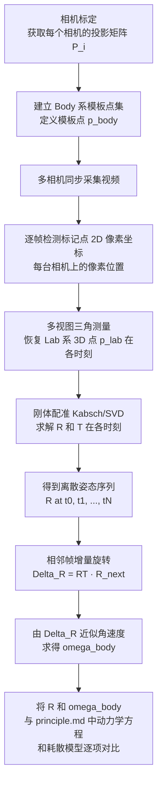

# 由多相机视频重建旋转矩阵 \(\mathcal{R}(t)\) 的具体步骤

> 本说明对应 `实验设计.md` 中的“多相机 + 标记点的姿态与角速度重建”附录，对其中的关键计算步骤做更“算法化”的整理，方便实现。

---

## 1. 前期准备

1. **Body 系模板点集 \(\{\vec p_{k,body}\}\)**  
   - 在刚体表面布置 \(N\ge 4\) 个不共面的标记点（颜色/形状容易识别）。  
   - 在 Body Frame 中，给每个标记点定义固定坐标 \(\vec p_{k,body}\in\mathbb{R}^3\)。这一组点构成“刚体模板”。

2. **相机标定**  
   - 对每台相机做内参 + 外参标定，得到投影矩阵  
     \[
     P_i = K_i [R_i\,|\,t_i], \quad i = 1,2,\dots,M,
     \]
     其中 \(M\) 是相机数目。  
   - 标定结果用于后续“多视图 2D→3D 三角测量”。

3. **时间同步**  
   - 保证各相机视频在时间轴上的同步（硬件触发或后期对齐），使得同一帧序号 \(t_j\) 对应同一物理时刻 \(t_j\)。

---

## 2. 每一帧从 2D 像素到 Lab 系 3D 点

对每一个时间步 \(t_j\)：

1. **检测 2D 像素坐标**  
   - 在每台相机的图像上，检测所有标记点的 2D 像素坐标 \(\vec u_{k,i}(t_j)\)。  
   - 要求能在绝大部分相机上匹配到同一个物理标记点的像素位置（可手工/自动跟踪）。

2. **多视图三角测量**  
   - 利用各相机的投影矩阵 \(P_i\) 和对应的像素坐标 \(\vec u_{k,i}(t_j)\)，对每个标记点 \(k\) 做三角测量，恢复其在 Lab Frame 下的 3D 坐标：
     \[
     \vec p_{k,lab}(t_j) \in \mathbb{R}^3.
     \]
   - 这样，在时刻 \(t_j\) 得到一组点对应：
     \[
     \big\{\vec p_{k,body}\big\} \longleftrightarrow \big\{\vec p_{k,lab}(t_j)\big\}.
     \]

---

## 3. 刚体配准：由模板点求 \(\mathcal{R}(t_j),\,\vec T(t_j)\)

假设刚体是严格刚性的，Body 系到 Lab 系的几何关系在每个时刻 \(t_j\) 可以写成
\[
\vec p_{k,lab}(t_j) \approx \mathcal{R}(t_j)\,\vec p_{k,body} + \vec T(t_j),
\]
其中 \(\mathcal{R}(t_j)\in SO(3)\) 是旋转矩阵，\(\vec T(t_j)\) 是平移向量。为求出 \(\mathcal{R}(t_j)\)，可采用 Kabsch 算法（刚体配准）：

1. **计算两组点的质心**  
   \[
   \vec c_{body} = \frac{1}{N}\sum_k \vec p_{k,body},\quad
   \vec c_{lab}(t_j) = \frac{1}{N}\sum_k \vec p_{k,lab}(t_j).
   \]

2. **去中心化**  
   \[
   \vec q_{k,body} = \vec p_{k,body} - \vec c_{body},\quad
   \vec q_{k,lab}(t_j) = \vec p_{k,lab}(t_j) - \vec c_{lab}(t_j).
   \]

3. **构造协方差矩阵**  
   \[
   H(t_j) = \sum_k \vec q_{k,body}\,\vec q_{k,lab}(t_j)^T,\quad H\in\mathbb{R}^{3\times 3}.
   \]

4. **对 \(H\) 做 SVD 分解**  
   \[
   H = U\,\Sigma\,V^T.
   \]

5. **求旋转矩阵**  
   - 先令
     \[
     \mathcal{R}(t_j) = V\,U^T.
     \]
   - 若发现 \(\det(\mathcal{R}) < 0\)，按 Kabsch 算法对 \(V\) 的最后一列取反，再重算一次，保证 \(\det(\mathcal{R}) = +1\)。

6. **求平移向量（如有需要）**  
   \[
   \vec T(t_j) = \vec c_{lab}(t_j) - \mathcal{R}(t_j)\,\vec c_{body}.
   \]

这样，在每个时间步 \(t_j\) 上，就得到了与 `principle.md` / `实验设计.md` 中记号一致的旋转矩阵 \(\mathcal{R}(t_j)\)（Body→Lab 的姿态）。

---

## 4. 从离散序列 \(\mathcal{R}(t_j)\) 到角速度 \(\vec\omega_{body}(t_j)\)

这一步对应 `实验设计.md` 附录中的姿态运动学方程：
\[
\frac{d\mathcal{R}}{dt} = \mathcal{R}\,[\vec{\omega}_{body}]_\times.
\]
离散实现时，可以采用“相邻两帧增量旋转”的思路：

1. **计算增量旋转矩阵**  
   \[
   \Delta \mathcal{R}_j = \mathcal{R}^T(t_j)\,\mathcal{R}(t_{j+1}).
   \]
   当采样足够快时，\(\Delta \mathcal{R}_j\) 可视为一次“小旋转”。

2. **从小旋转读出角速度**  
   - 对 \(\Delta \mathcal{R}_j\) 做对数映射，或在“小角度”近似下
     \[
     [\vec{\omega}_{body}(t_j)]_\times \approx \frac{\Delta \mathcal{R}_j - I}{\Delta t}.
     \]
   - 再从反对称矩阵 \([\vec{\omega}_{body}]_\times\) 的三个独立分量中读出 \(\vec{\omega}_{body}(t_j)\)。

3. **噪声与平滑**  
   - 实际含噪数据中，直接两帧差分会放大噪声，可对 \(\mathcal{R}(t_j)\)（或四元数表示）做时间平滑后再求导；或在一个小时间窗内直接拟合出“最佳常矢量” \(\vec{\omega}_{body}\)。

---

## 5. 小结：从视频到 \(\mathcal{R}(t)\) 的流水线

整体流程可以概括为：

1. 相机标定 → 得到所有 \(P_i\)。  
2. 为刚体建立 Body 系模板点集 \(\{\vec p_{k,body}\}\)。  
3. 对每一帧：
   - 多相机上检测标记点 2D 像素坐标；
   - 做多视图三角测量，恢复 3D 点 \(\{\vec p_{k,lab}(t_j)\}\)；
   - Kabsch 刚体配准，求得 \(\mathcal{R}(t_j),\vec T(t_j)\)。  
4. 得到离散序列 \(\mathcal{R}(t_j)\) 后，可以进一步通过增量旋转求角速度 \(\vec{\omega}_{body}(t_j)\)，并与 `principle.md` 中的欧拉方程及耗散模型逐项对比。

该说明与现有 `principle.md` / `实验设计.md` 完全一致，只是把“从视频到 \(\mathcal{R}(t)\)”的关键计算步骤以更接近实现的形式单独整理出来，便于在代码中逐步对应。

## 流程图示意

